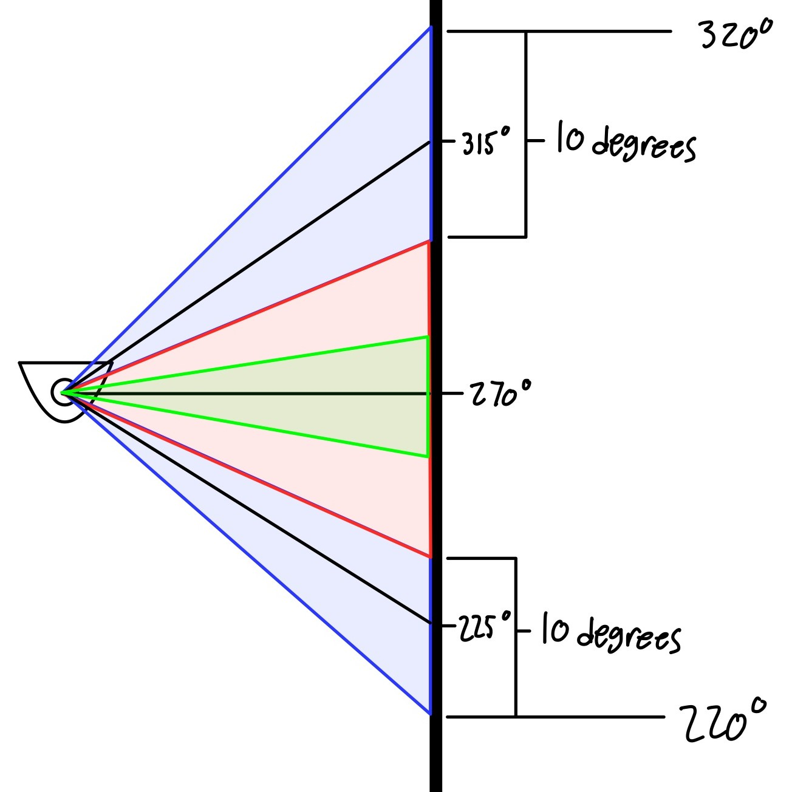

# CompRobo_warmup_proj

## Rosbag ##

The goal for this section was to record manual teleop control into a bag file and then play back those commands from the recorded bag. One of the challenges I am running into is that the Neato does not follow the exact path as the teleop. I'm assuming this is due to the bag running in real-time and the gazebo simulation not running at the same speed. I currently do not know how to fix this discrepency.

Neato following Rosbag instructions:

## Robot Teleop ##

The goal for this section was to program our own teleop controller for the Neato. I used a control scheme where the "WASD" keys were used to increment/decrement the linear and angular velocities of the Neato. These velocities were then sent to the Neato via Twist messages on the `/cmd_msg` topic.

The Teleop program in action:

## Drive a Square ##

The goal for this section was to drive in a square 1m x 1m. I accomplished this by having the Neato alternate between driving in a straight line for a set time, and turning to the left for a set time. I used a guess and check method to set the timings for the forward and turning sections. This was initially just using visual estimations but after that I used the simulation's odometry topic to track the x and y coordinates of the robot to increase the accuracy.

Driving a Square in action (each square is 1m x 1m):

## Wall Following ##

The goal for this section was to get the Neato to find and drive parallel to a wall. In order to do this, I took the LIDAR data from the right side of the Neato. From there I looked at the 10 degrees surrounding 225 degrees and 315 degrees and took the average of the differences between corresponding points (320 corresponds to 220, 225 to 315, etc). The idea behind this is that if the robot is lined up parallel with the wall, the differences in the angles would be almost 0. Comparing the differences allows the program to track the Neato's rotation relative to the wall. From there, I took that average, scalled it, and then used that as the yaw value. This effectively creates a porportional controller for the yaw. This control scheme also allows the Neato to follow corners pretty cleanly (See gif below).

To create a marker to identify the wall, I took the 5 degrees around 270 degrees and averaged the distance. This accounts for any odd variances in the LIDAR data.

The Following image shows the collected LIDAR data and what it's used for:

- Blue: Scans around +- 45 degrees taht are used to figure how parallel to the wall the neato is
- Green: Used to find the distance to the wall
- Red: Data is also captured but not used for anything

Wall Follower in action:

## Person Follower ##

The goal for this section was to have the Neato follow a human around. In order to accomplish this, I took the LIDAR scans and found all of the points that fell into a specified square in front of the Neato. I then averaged the x and y positions of those points to find a rough center of mass and used that average to plug directly into the forward and rotational components of the twist command sent to the Neato. This effectively created a porportional controller that would follow a human around.

Person follower in action:

## Obstacle Avoider ##

For this part, the goal was to find obstacles and avoid driving int o them while continuing to drive forward. For this I reused portions of my person following code but swapped the porportional control to avoid obstacles that were detected in front of it as opposed to following it.

Obstacle Avoider in action:

## Finite State Control ##

The goal for this section was to come up with a new behavior that could be modeled using a finite state controller. This means that the robot has destinctive states taht have different behaviors and switches between the states based on diferent stimuli. In this case, I made the robot repeatedly run itself into the wall. The state machine has 2 states:

1. **Drive Forward**
    - Switches to State 2 (Drive Backwards) upon any of the bumpers being triggered.
    - Will stay in State 1 indefinately if a bumper is never triggered
2. **Drive Backwards**
    - Switches to State 1 after being in State 2 for more than 2 seconds.

The combination of these states mean that the robot will effectively "search" for a wall, then repeatedly run into it.

Finite State Machine in action:

I couldn't set the cube to static for some reason but if you imagine the cube as a static wall, the robot would not be able to move it and would repeatedly run into the same spot.

## Takeaways ##

The overall code for this project had each new behavior (person follower, obstacle avoidance, etc) as a seperate file. There was a main function that would execute other functions to create a ross node, as well as deal with running the node. Helper functions would be created within each node as needed to simplify the code.

One of the biggest challenges I faced was that I am relearning ros currently and having to try to thin about how to structure things to work in a ros framework. This involves a lot of communicating via messages and figuring out how to work efficiently with those messages. I also had a lot of issues with overscoping things and over complicating behaviors. My first instinct on how to tackle a behavior would often me way too difficult or over scoped and I would waste a lot of time trying to implement a difficult sollution.

If I had more time I would love to impreove my obsacle avoider code. Currently, if you line the obstacle directly up in front of the Neato, it will not turn away from it. this is because the porportional control is set up so that the Neato turns faster as it turns away so if the obstacle is directly in front, it wont turn at all. I would also love to clean up my code in genral and add some comments to help me and others understand what I did.

I need to pay more attention to the scope of the project as I wasted a lot of time on code that eventually didnt work or was jsut too complocated to work well. I also took away a lor about how to work with ros messages. For example, you only need to send Twist messages when you want the message to be updated. Small things like this were very helpful to me figuring out how to structure my code.